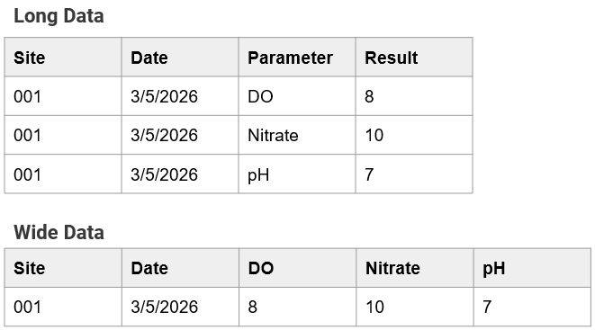
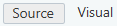
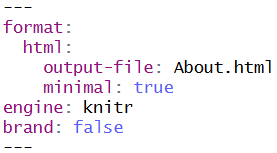

# WQdashboard

## Overview

WQdashboard is an open-source dashboard template that can be used to
display water quality data using interactive maps, report cards, and
graphs. It is designed for water quality organizations who want to share
their data with the public.

WQdashboard is written in [R
Shiny](https://shiny.posit.co/r/getstarted/shiny-basics/lesson1/). No
coding knowledge is required to set up or run WQdashboard, although
advanced users can take advantage of the modular code to fully customize
WQdashboard to meet their needs.

If you are new to R, please read
[`vignette("intro_to_r")`](https://nbep.github.io/WQdashboard/articles/intro_to_r.md)
for instructions on which programs to download and how to use them.

## Supported Data Formats

Although WQdashboard has a native data format, it accepts multiple input
formats for site, result, and threshold data. Templates for
WQdashboard’s format can be found in the `inst/extdata` folder.

Supported formats are listed below.

| Format                     | Code        | Sites | Thresholds | Results |
|----------------------------|-------------|:-----:|:----------:|:-------:|
| Blackstone River Coalition | MA_BRC      |   x   |     x      |    x    |
| Friends of Casco Bay       | ME_FOCB     |   x   |     x      |    x    |
| Maine DEP                  | ME_DEP      |       |     x      |    x    |
| MassWateR                  | MassWateR   |   x   |     x      |    x    |
| RIDEM                      | RI_DEM      |       |     x      |    x    |
| URI Watershed Watch        | RI_WW       |   x   |     x      |    x    |
| WQdashboard                | WQdashboard |   x   |     x      |    x    |
| WQX                        | WQX         |   x   |     x      |    x    |

### Custom Data Formats

Unsupported data formats can still be used as long as the tables are
[long and not wide](https://en.wikipedia.org/wiki/Wide_and_narrow_data),
eg each observation is placed on its own row.



Long vs wide tables

To use a custom format, fill out the csv files in
`data-raw/custom_format`.

| File | Description | Used For |
|----|----|----|
| colnames_extra.csv | Column names for categorical result data | Categorical Results |
| colnames_results.csv | Column names for result data | Results |
| colnames_sites.csv | Column names for site metadata | Sites |
| varnames_activity.csv | Variable names for activity types | Results, Categorical Results |
| varnames_parameters.csv | Variable names for parameters | Thresholds, Results, Categorical Results |
| varnames_qualifiers.csv | Variable names for qualifiers | Results, Categorical Results |
| varnames_units.csv | Variable names for units | Thresholds, Results, Categorical Results |

## Initial Set Up

The `data-raw` folder contains a series of numbered scripts. These
scripts must be run in order, although steps 0-4 do not need to be rerun
after initial setup. Steps 2, 4, and 6 are optional. Each script
contains a detailed description of what it does. Some of the scripts
also include **variables** after the description. Before running a
script, edit any variables by changing the text to the right of `<-`.
All text should be in quotes except for the special values `NA`, `TRUE`,
and `FALSE`.

**Example**

``` r

sites_csv <- "sites.csv"
in_format <- "WQdashboard"
default_state <- NA
```

To run a script, use `CTRL` + `SHIFT` + `ALT` on a Windows computer or
`CMD` + `SHIFT` + `ALT` on a Mac.

### 00_install.R

This script installs all of the packages needed to run WQdashboard. It
also installs [tinytex](https://yihui.org/tinytex/), which is used to
generate PDFs.

### 01_customize_website.R

This script is used to customize the site theme, “About” page, and
“Download” page.

Before running this script, open the `inst/app/www` folder and update
the following files: `About.qmd`, `Download.qmd`, and `_brand.yml`

`About.qmd` sets the content for the “About” page. It contains some
default text which can be replaced.

`Download.qmd` sets some of the content for the “Download” page; on the
dashboard itself, a “Download” button will be placed below the contents
of `Download.qmd`. `Download.qmd` contains default text with a suggested
citation and some light code to dynamically update the organization name
and latest year updated; feel free to replace these elements with static
text or remove them entirely.

`About.qmd` and `Download.qmd` are both [Quarto](https://quarto.org/)
documents. If you are unfamiliar with Quarto, you can select “Visual”
mode in the upper left corner of the document window and edit the
documents the same way as a Word document. You may add images to
`About.qmd` and `Download.qmd` as long as they are stored in the
`inst/app/www` folder. Tables are also fully supported.



Source, Visual mode toggle

**IMPORTANT** Do not change the header for either Quarto document.



Quarto header

**IMPORTANT** Changes to `About.qmd` and `Download.qmd` will only be
reflected in the website if you run `01_customize_website.R`.

`_brand.yml` lets you customize the appearance of the site. Set line 2
(`name:`) to the name of your organization and line 3 (`title:`) to your
desired website title. The remaining lines set the color palette and
fonts for the website. If you would like to learn more about custom
themes, visit the [\_brand.yml](https://posit-dev.github.io/brand-yml/)
website.

**IMPORTANT** You must update line 2 (`name:`) to your organization name
to ensure your organization is properly credited on the “Download” and
“Report Card” tabs.

### 02_add_shapefiles.R

*Optional.* If you would like to add custom watershed or river layers to
the interactive map, use this script to upload shapefiles. Shapefiles
must be stored in the `data-raw` folder.

Shapefiles must use the WGS 1984 projection. Higher resolution
shapefiles take longer to load and may slow down the website.

#### Variables

- **watershed_shp**: Name of the watershed shapefile. Must be a polygon
  layer. Set to `NA` if you do not want to upload a shapefile.

- **watershed_name_col**: Watershed column name. This column will be
  used to label each watershed polygon.

- **river_shp**: Name of river shapefile. Must be a polyline layer. Set
  to `NA` if you do not want to upload a shapefile.

- **river_name_col**: River column name. This column will be used to
  label each river polyline.

### 03_add_sites.R

This script uploads site metadata. Site metadata must be saved as a csv
file in the `data-raw` folder. See [Supported Data
Formats](#supported-data-formats) for a list of supported formats. To
use a custom format, set the `in_format` variable to “custom” and fill
out this file: `data-raw/custom_format/colnames_sites.csv`

If you would like to use the official WQdashboard format, a template can
be found at `inst/extdata/template_sites.csv`

#### Variables

- **sites_csv**: Name of csv file containing site metadata.

- **in_format**: Input format. Not case sensitive. Options: WQdashboard,
  WQX, MassWateR, RI_WW, MA_BRC, ME_FOCB, custom

- **default_state**: State name or abbreviation. Any blank values in the
  “State” column will be updated to this value. Set to `NA` to leave
  blanks as-is.

### 04_add_thresholds.R

*Optional.* Thresholds are used to determine whether parameter values
should be classified as excellent, good, fair, or poor. By default,
WQdashboard includes several thresholds based on state or federal
regulations. Some thresholds, however, are highly site specific - for
example, [Rhode Island water quality
regulations](https://www.epa.gov/system/files/documents/2026-04/rhode-island-wqs.pdf)
dictate that turbidity should not exceed 5 NTU over background values
for class AA water. To account for such regulations, WQdashboard lets
users add site, group, and/or state specific thresholds.

To include custom thresholds, fill out the custom threshold template at
`data-raw/thresholds.csv`. A copy of this file can be found at
`inst/extdata/template_thresholds.csv` if needed.

When adding custom thresholds, each threshold should be placed on its
own row. Here is what the columns mean:

- `State`, `Group`, `Site_ID`: These columns determine which site(s) the
  threshold applies to. Each row may include a Group *or* Site_ID but
  not both. If all three columns are blank, the threshold will be
  applied to all sites.

- `Depth_Category`: OPTIONAL. If you want the threshold to apply to a
  specific depth category, specify that here. f this column is left
  blank, then the threshold will be applied to all depth levels. Values:
  Surface, Midwater, Near Bottom, Bottom

- `Parameter`, `Unit`: Parameter, unit.

- `Calculation`: Method used to calculate an annual numeric score.
  Acceptable values: minimum, maximum, average, median, geometric mean,
  90th percentile

- `Threshold_Min`, `Threshold_Max`: The minimum and maximum acceptable
  values. Must enter a value for at least one column.

- `Excellent`, `Good`, `Fair`: The threshold cut off values for
  excellent, good, and fair results. Either leave all three columns
  blank or fill all three of them out.

If multiple thresholds are provided for the same location, depth, and
parameter, then *all* of the thresholds will be applied and the lowest
score will be used.

**Example**

In the table below, Enterococcus must have an annual geometric mean
below 35 cfu/100mL *and* a 90th percentile below 130 cfu/100mL or else
it will be assigned a score of “Does Not Meet Criteria.” Total Coliform,
however, only needs to have a 90th percentile below 100 cfu/100mL.

| State | Group | Depth_Category | Parameter | Unit | Calculation | Threshold_Min | Threshold_Max | Excellent | Good | Fair |
|----|----|----|----|----|----|----|----|----|----|----|
| MA |  |  | Enterococcus | cfu/100mL | geometric mean |  | 35 |  |  |  |
| MA |  |  | Enterococcus | cfu/100mL | 90th percentile |  | 130 |  |  |  |
| MA |  |  | Total Coliform | cfu/100mL | 90th percentile |  | 100 |  |  |  |

#### Variables

- **skip_step**: Set to `TRUE` to skip this step and go to the next
  file. Set to `FALSE` if you would like to add custom thresholds.

- **threshold_csv**: Name of csv file containing threshold metadata.

- **in_format**: Format used for parameters and units. Not case
  sensitive Accepted values: WQdashboard, WQX, MassWateR, RI_DEM, RI_WW,
  MA_BRC, ME_DEP, ME_FOCB, Custom. If using a custom format, update the
  following files:

  - `data-raw/custom_format/varnames_parameters.csv`
  - `data-raw/custom_format/varnames_units.csv`

### 05_add_results.R

This script adds or updates result data. Only numeric results are
accepted; categorical results should be uploaded using
`06_add_categorical_results.csv`. Result data must be saved as a csv
file in the `data-raw` folder. Multiple data formats are supported (see
[Supported Data Formats](#supported-data-formats)). A template for the
official WQdashboard format can be found at
`inst/extdata/template_results.csv`

If using an unsupported/custom format, set `in_format` to “custom” and
update the following files:

- `data-raw/custom_format/colnames_results.csv`
- `data-raw/custom_format/varnames_activity.csv`
- `data-raw/custom_format/varnames_parameters.csv`
- `data-raw/custom_format/varnames_qualifiers.csv`
- `data-raw/custom_format/varnames_units.csv`

#### Variables

- **results_csv**: Name of CSV file containing result data.

- **in_format**: Input format. Not case sensitive. Accepted values:
  WQdashboard, WQX, MassWateR, RI_DEM, RI_WW, MA_BRC, ME_DEP, ME_FOCB,
  custom

- **date_format**: Format used for “Date” column. Example: “m/d/y”. List
  of abbreviations:

  - B - Full month name (August)
  - b - Abbreviated month name (Aug)
  - m - Month, numeric (8)
  - d - Day of the month
  - y - Year without century (26)
  - Y - Year with century (2026)
  - H - Hour
  - m - Minute
  - S - Second
  - p - AM/PM
  - z - Timezone

- **timezone**: Timezone.

- **overwrite_existing**: If `TRUE`, replaces old result data with new
  data. If `FALSE`, combines old and new result data.

- **recalculate_score**: If `TRUE`, recalculates all parameter scores,
  including old data. If `FALSE`, does not recalculate old scores.

- **update_citation**: If `TRUE`, will update the “year_updated”
  variable for `Download.qmd`

### 06_add_categorical_results.R

*Optional.* This script adds or updates categorical and/or download only
result data. This data will ONLY be available for download, and will not
display on the maps, report card, or graph tabs. Categorical result data
must be saved as a csv file in the `data-raw` folder. Multiple data
formats are supported (see [Supported Data
Formats](#supported-data-formats)). A template for the official
WQdashboard format can be found at `inst/extdata/template_results.csv`

If using an unsupported/custom format, set `in_format` to “custom” and
update the following files:

- `data-raw/custom_format/colnames_results.csv`
- `data-raw/custom_format/varnames_activity.csv`
- `data-raw/custom_format/varnames_parameters.csv`
- `data-raw/custom_format/varnames_qualifiers.csv`
- `data-raw/custom_format/varnames_units.csv`

#### Variables

- **results_csv**: Name of CSV file containing result data.

- **in_format**: Input format. Not case sensitive. Accepted values:
  WQdashboard, WQX, MassWateR, RI_DEM, RI_WW, MA_BRC, ME_DEP, ME_FOCB,
  custom

- **date_format**: Format used for “Date” column. Example: “m/d/y”. List
  of abbreviations:

  - B - Full month name (August)
  - b - Abbreviated month name (Aug)
  - m - Month, numeric (8)
  - d - Day of the month
  - y - Year without century (26)
  - Y - Year with century (2026)
  - H - Hour
  - m - Minute
  - S - Second
  - p - AM/PM
  - z - Timezone

- **timezone**: Timezone.

- **overwrite_existing**: If `TRUE`, replaces old categorical result
  data with new data. If `FALSE`, combines old and new categorical
  result data.

- **update_citation**: If `TRUE`, will update the “year_updated”
  variable for `Download.qmd`

### 07_preview.R

This script launches WQdashboard on your local computer and lets you
preview how it looks. This step should always be run before
`08_launch.R` in order to check for bugs.

### 08_launch.R

Run this script to create or update WQdashboard as a website. In order
to host WQdashboard on [shinyapps.io](https://www.shinyapps.io/) or
[posit connect](https://posit.co/products/enterprise/connect), you MUST
create an account first.

NOTE: If you have added custom thresholds, shapefiles, or categorical
data, you may receive a warning message about undocumented variables.
This message can be safely ignored, but if you want to stop seeing it,
go to `R/data.R` and uncomment the section describing the relevant
file(s) by removing the first `#` at the start of each line. (You can
also select the relevant section and use `CTRL` + `SHIFT` + `C`)

For more information, see
[`vignette("publishing")`](https://nbep.github.io/WQdashboard/articles/publishing.md).

#### Variables

- **launch_to**: Where to upload your website. Options: “shinyapps.io”,
  “posit connect”, “shiny server”

- **create_docker_file**: Whether to generate a tar.gz file that can be
  used to install the app locally.

## Updating Data

WQdashboard data can be updated at any time by running the appropriate
scripts. After adding or modifying data, run `07_preview.R` to check for
bugs and `08_launch.R` to update the website.

### Updating Dashboard Appearance

To update the “About” or “Download” page, run `01_customize_website.R`.
Changes to `_brand.yml` are automatically applied, even if
`01_customize_website.R` is not run.

### Updating Site Metadata

To update site metadata, run `03_add_sites.R`. This will overwrite any
existing site metadata.

### Updating Custom Thresholds

To update custom thresholds, run `04_add_thresholds.R`. This will
overwrite any existing custom thresholds.

To ensure the new thresholds are properly applied to prior results data,
run `05_add_results.R` with `recalculate_score` set to `TRUE`.

### Adding New Results

Run `05_add_results.R` and/or `06_add_categorical_results.R` to add new
result data. If `overwrite_existing` is `TRUE`, this will overwrite the
previous results, but if `overwrite_existing` is `FALSE`, then the new
results will be added to the old results without overwriting them.
