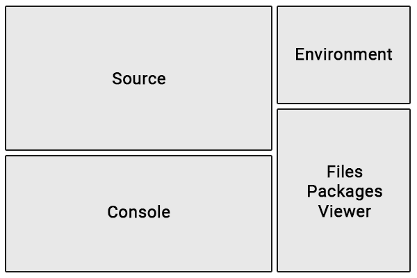

```{r, include = FALSE}
knitr::opts_chunk$set(
  collapse = TRUE,
  comment = "#>"
)
```

## Overview

[R](https://www.r-project.org/) is a free, open source coding language. It is frequently used for data analysis, although it can also be used to build websites with [R Shiny](https://shiny.posit.co/r/getstarted/shiny-basics/lesson1/).

## RStudio

[RStudio](https://posit.co/download/rstudio-desktop/) is a free integrated development environment (IDE), which provides a user-friendly interface to create and maintain R projects. To run RStudio, you must also download [R](https://cran.rstudio.com/).

### Layout

The default RStudio layout includes four windows, each with multiple tabs. The most important tabs and their locations are shown below:

{fig-alt="Upper left, Source. Lower left, Console. Upper right, Environment. Lower right, files, packages, viewer."}

Here is a brief overview of what each tab does:

-   **Source:** View, edit, and run R scripts
-   **Console:** Type R commands. Also displays messages, warnings, and errors when code is run.
-   **Environment:** View stored variables.
-   **Files:** View folders and files. Add, open, rename, or delete files here.
-   **Packages:** Install or update R packages.
-   **Viewer:** View rendered files.

You can customize R Studio's appearance and behavior under Tools \> Global Options.

### Folder Structure

Every RStudio project must be placed in its own folder, and WQdashboard is no exception. When you [download WQdashboard from github](https://github.com/nbep/wqdashboard), you will receive a zipped folder. After you unzip the folder, **do not rename or move any of the files or folders unless you are experienced with R**. The following files and folders are especially important:

-   data
-   data-raw
-   DESCRIPTION
-   inst
-   R
-   tests
-   wqdashboard.Rproj

To open WQdashboard in RStudio, open `wqdashboard.Rproj`. The WQdashboard folder will be shown in the "Files" tab. All of the files you need to add data or run WQdashboard can be found in the `data-raw` folder. The scripts in `data-raw` are numbered in the order they should be run and include detailed instructions at the top of each file. If it is your first time using WQdashboard, run `00_install.R` before doing anything else.

To run a script, use `CTRL` + `SHIFT` + `ENTER` on a Windows computer or `CMD` + `SHIFT` + `ENTER` on a Mac.

### Packages

Due to its open source nature, R's capabilities can be greatly expanded by downloading **packages** containing custom code. WQdashboard uses multiple packages, including [R Shiny](https://shiny.posit.co/r/getstarted/shiny-basics/lesson1/), [importwqd](https://github.com/nbep/importwqd), and [wqformat](https://github.com/massbays-tech/wqformat). **WQdashboard can not run unless these packages are installed.** To download all of the required packages, run `data-raw/00_install.R`.

Packages may be updated from time to time in order to fix bugs or add new features. If you are prompted to update packages, do so.

To manually install or update packages, select the "Packages" tab in the lower right window. The "Install" and "Update" buttons can be used to add or update packages.
