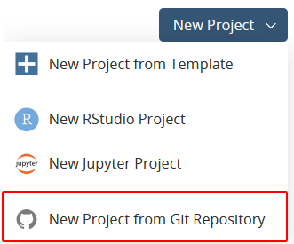
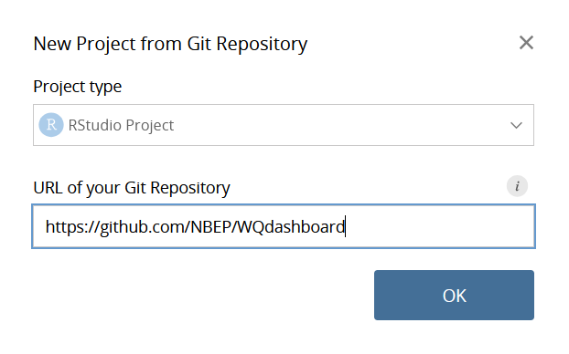

```{r, include = FALSE}
knitr::opts_chunk$set(
  collapse = TRUE,
  comment = "#>"
)
```

## Overview

[R](https://www.r-project.org/) is a free, open source coding language. It is frequently used for data analysis, although it can also be used to build websites with [R Shiny](https://shiny.posit.co/r/getstarted/shiny-basics/lesson1/).

## RStudio

[RStudio](https://posit.co/download/rstudio-desktop/) is a free integrated development environment (IDE), which provides a user-friendly interface to create and maintain R projects. RStudio is a free program that can be downloaded and installed on your computer. To run RStudio, you must also download [R](https://cran.rstudio.com/).

[Posit Cloud](https://posit.cloud/) is a cloud based website that runs RStudio from the browser. The primary advantages of Posit Cloud are that nothing needs to be installed, projects can be shared between users, and it automatically uses the latest version of R. The downsides are that an account is required, it only allows 25 hours of free use per month, and an internet connection is required.

### Layout

The default RStudio layout includes four windows, each with multiple tabs. The most important tabs and their locations are shown below:

{fig-alt="Upper left, Source. Lower left, Console. Upper right, Environment. Lower right, files, packages, viewer."}

Here is a brief overview of what each tab does:

-   **Source:** View, edit, and run R scripts
-   **Console:** Type R commands. Also displays messages, warnings, and errors when code is run.
-   **Environment:** View stored variables.
-   **Files:** View folders and files. Add, open, rename, or delete files here.
-   **Packages:** Install or update R packages.
-   **Viewer:** View rendered files.

You can customize R Studio's appearance and behavior under Tools \> Global Options.

### Projects

Every RStudio project must be placed in its own folder, and WQdashboard is no exception. The data, code, and documents are all stored in specific places, so **do not rename or move any of the files or folders unless you are experienced with R**. The following files and folders are especially important:

-   data
-   data-raw
-   DESCRIPTION
-   inst
-   R
-   tests
-   wqdashboard.Rproj

#### Starting a Project
 
##### RStudio 

To run WQdashboard from RStudio, [download WQdashboard from github](https://github.com/nbep/wqdashboard). Unzip the folder and open `wqdashboard.Rproj`. 

##### Posit Connect

To run WQdashboard from Posit Connect, go to `Your Workspace` > `New Project` > `New Project from Git Repository`. 

{fig-alt="Blue button labeled New Project with four dropdown items. Last dropdown item is circled in red and reads New Project from Git Repository."}

In the New Project pop up, enter the link to the WQdashboard github repository.

{fig-alt="Popup labeled New Project from Git Repository. First item is a dropdown labeled Project type. Option RStudio Project is selected. Second item is a textbox labeled URL of your Git Repository. Textbox is filled out with https://github.com/NBEP/WQdashboard"}

#### Running a Script

Once you have uploaded WQdashboard to RStudio or Posit Cloud, find the `Files` window and open the `data-raw` folder. All of the scripts you need to add data or run WQdashboard can be found in this folder, and have been numbered in the order they should be fun. Each script contains detailed instructions at the top of the file. Make sure you start with `00_install.R`, especially if this is your first time using WQdashboard.

To run a script, use `CTRL` + `SHIFT` + `ENTER` on a Windows computer or `CMD` + `SHIFT` + `ENTER` on a Mac. 

**IMPORTANT** Do NOT use the "Run" button at the top of the source window - this button will only run the current line or any highlighted text, *not* the entire script.

### Packages

Due to its open source nature, R's capabilities can be greatly expanded by downloading **packages** containing custom code. WQdashboard uses multiple packages, including [R Shiny](https://shiny.posit.co/r/getstarted/shiny-basics/lesson1/), [importwqd](https://github.com/nbep/importwqd), and [wqformat](https://github.com/massbays-tech/wqformat). **WQdashboard can not run unless these packages are installed.** To download all of the required packages, run `data-raw/00_install.R`.

Packages may be updated from time to time in order to fix bugs or add new features. If you are prompted to update packages, do so.

To manually install or update packages, select the "Packages" tab in the lower right window. The "Install" and "Update" buttons can be used to add or update packages.
